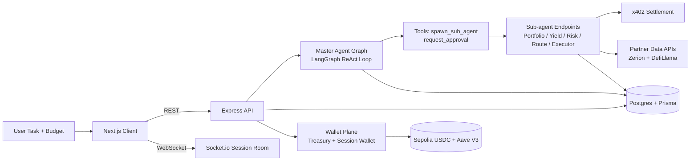

# OhMySwarm

Autonomous DeFi execution with coordinated AI agents, live observability, and policy-gated spending.

OhMySwarm takes a single user intent and turns it into a structured multi-agent workflow:

- discover portfolio context
- scan yield opportunities
- analyze risk
- plan execution routes
- execute deposits (real on Sepolia in paid mode)

All with real-time telemetry in the UI and explicit approval checkpoints before critical phases.

## Why This Is Different

Most "AI trading" demos are a single prompt + static answer. OhMySwarm is built as an execution system:

- Stateful orchestration with a durable graph runtime (LangGraph + Postgres checkpointing)
- Budget-aware agent spawning with deterministic spend accounting
- x402 micropayment rails between master and sub-agents
- Session-scoped wallet lifecycle with treasury controls and optional real on-chain settlement
- Real-time event streaming to a split-screen operations console

## Architecture At A Glance



## Core Runtime Design

### 1. Orchestration Plane

The master agent runs in a LangGraph loop and can call only two high-leverage tools:

- `spawn_sub_agent`: fan-out work to specialist agents (executed in parallel)
- `request_approval`: pause graph and await explicit human decision

Runtime characteristics:

- durable thread state per session (`thread_id = sessionId`)
- resumable interrupts for approval workflows
- context summarization after repeated tool calls to prevent context bloat

### 2. Execution Plane

Each specialist role is exposed as a backend endpoint and billed via x402 semantics before execution.

Current roles:

- `portfolio-scout`
- `yield-scanner`
- `risk-analyst`
- `route-planner`
- `executor`

Execution guarantees:

- atomic budget reservation before sub-agent spawn
- persisted payment and agent lifecycle records
- structured event emission (`AGENT_SPAWNED`, `PAYMENT_CONFIRMED`, `AGENT_COMPLETE`, `AGENT_FAILED`)

### 3. Wallet and Payment Plane

OhMySwarm uses a treasury-to-session wallet model:

- Treasury wallet is the system funding source
- Every session gets an isolated wallet (ephemeral keypair)
- Session private keys are encrypted at rest (`SESSION_WALLET_ENCRYPTION_KEY`)
- In paid mode, USDC transfer + gas top-up are real on Sepolia

Billing modes:

- `free`: deterministic mock balances and mock transfers for local/demo speed
- `paid`: real transfer signing + on-chain confirmations

### 4. Data and State Plane

All execution artifacts are persisted:

- sessions and lifecycle state
- agent tree and outputs
- tool calls and timing
- payments and tx hashes

This enables:

- robust session replay and debugging
- deterministic UI reconstruction
- post-run analytics and judge-friendly transparency

## Frontend System Design

The session interface is intentionally split into two operational surfaces:

- Left: swarm topology canvas (React Flow)
- Right: activity / chat / details terminal

Design goals:

- make parallelism visible
- make spending auditable
- keep operator control one click away (approval modal + follow-up chat)

Notable UX patterns:

- floating follow-up dock under the canvas for rapid iteration
- launch handoff screen that redirects quickly once first activity starts
- activity stream with payment hashes linked to explorers
- live connection state and session status badges

## Partner APIs and Protocols In Use

- Open Wallet Standard (`@open-wallet-standard/core`) for wallet abstractions
- x402 (`@x402/core`, `@x402/express`) for pay-per-call execution rails
- Zerion API for wallet portfolio context
- DefiLlama API for yield + protocol intelligence
- Aave V3 on Sepolia for real deposit execution path in paid mode

## Repository Structure

```text
client/                 Next.js app (canvas + terminal UI)
server/                 Express + Socket.io + agent runtime
server/agent/           LangGraph orchestration and prompts
server/subagents/       Specialist executors
server/integrations/    Zerion + DefiLlama adapters
server/tools/           Master tools (spawn, approval)
prisma/schema.prisma    Session/agent/payment data model
docs/ARCHITECTURE.md    Deep architecture and sequence diagrams
```

## Local Development

### Prerequisites

- Node.js 20+
- npm
- Postgres (or Supabase)

### Setup

```bash
npm install
cp .env.example .env
npm run db:generate
npm run db:push
npm run dev
```

App endpoints:

- frontend: `http://localhost:3000`
- backend: `http://localhost:3001`

## Environment Profile

Minimum keys for a meaningful local run:

- `DATABASE_URL`
- `DIRECT_URL`
- `LLM_API_KEY`

To enable real payment + execution flow:

- `OWS_BILLING_MODE=paid`
- `TREASURY_PRIVATE_KEY`
- `FUNDING_RPC_URL`
- `SESSION_WALLET_ENCRYPTION_KEY`

Optional partner keys:

- `ZERION_API_KEY` (DefiLlama works without key)

## Deployment Notes (Render + Vercel)

- Backend expects CORS allowlist via `FRONTEND_URL` or `FRONTEND_URLS`
- Socket and REST should target backend origin from frontend env:
  - `NEXT_PUBLIC_API_URL`
  - `NEXT_PUBLIC_WS_URL`
- Health endpoint: `/health`

## What Judges Can Verify Quickly

1. Create a session with a budget and watch it move to running state.
2. Observe parallel sub-agent spawning in the canvas.
3. Inspect activity timeline for spend events and tx links.
4. Trigger follow-up chat to continue the same session graph.
5. Review approval gating before critical execution phases.

## Security and Safety Choices

- Session wallet key encryption at rest
- Policy checks before execution actions
- Explicit approval interrupt path
- Budget reservation before any paid agent invocation
- Session-level wallet isolation to reduce blast radius

## Roadmap

- Multi-chain execution beyond Sepolia
- Dynamic pricing for agent invocation
- Richer risk scoring and strategy simulation
- Expanded partner connectors and execution venues

---

Built for high-signal demos: autonomous where it should be, controllable where it must be.
