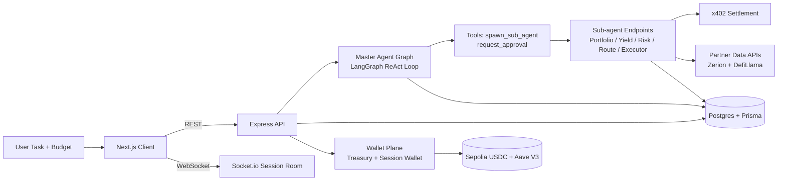

# OhMySwarm

Autonomous DeFi execution with coordinated AI agents, live observability, and policy-gated spending.

OhMySwarm takes a single user intent and turns it into a structured multi-agent workflow: discover portfolio context → scan yield opportunities → analyze risk → plan execution routes → execute deposits (real on Sepolia in paid mode). All with real-time telemetry in the UI and explicit approval checkpoints before critical phases.

---

## What judges should verify

| Agent Role | What It Does | On-Chain Proof |
|---|---|---|
| `portfolio-scout` | Queries Zerion API for real mainnet holdings: token balances, DeFi positions, chains, idle capital | [real tx — run in paid mode] |
| `yield-scanner` | Fetches live DefiLlama `/pools` endpoint, filters by TVL >$50M, sorts by base APY (not reward APY) | No on-chain tx — data query only |
| `risk-analyst` | Scores each pool 1–10 using TVL stability, IL formula, audit count from DefiLlama `/protocol/{slug}` | No on-chain tx — analysis only |
| `route-planner` | Plans tx sequence using real-time gas price from chain RPC + CoinGecko ETH price | No on-chain tx — planning only |
| `executor` | Calls `check_policy` (7-point deterministic engine), then `execute_deposit` (approve + supply on Aave V3) | [real tx — run in paid mode] |
| `chain-analyst` | DefiLlama `/v2/chains`, `/protocols`, `/stablecoins` — live TVL and stablecoin circulating supply per chain | No on-chain tx — data query only |
| `token-analyst` | CoinGecko free tier: live price, 24h change, market cap, trending tokens, global DeFi stats | No on-chain tx — data query only |
| `protocol-researcher` | DefiLlama `/overview/fees` + `/protocol/{slug}`: TVL history, daily/weekly fees, revenue, audit count | No on-chain tx — data query only |
| `liquidity-scout` | DefiLlama `/pools`: LP depth, volume/TVL ratio, single-sided vs multi-asset pools for a given token | No on-chain tx — data query only |

**Key facts:** 9 autonomous agents · Real Sepolia USDC transfers · Aave V3 deposit execution · x402 micropayment rails (live, not mocked) · LangGraph durable state + Postgres checkpointing · Zerion + DefiLlama partner integrations · Human approval checkpoints before critical execution

---

## Why this is different from other multi-agent demos

Most "AI trading" demos are a single prompt + static answer. OhMySwarm is built as an execution system:

- Stateful orchestration with a durable graph runtime (LangGraph + Postgres checkpointing)
- Budget-aware agent spawning with deterministic spend accounting
- x402 micropayment rails between master and sub-agents — each invocation costs real USDC from the session wallet
- Session-scoped wallet lifecycle with treasury controls and real on-chain settlement in paid mode
- Real-time event streaming to a split-screen operations console
- No hardcoded data: Zerion returns live mainnet portfolio, DefiLlama returns live pool APYs, gas prices from chain RPC

---

## Architecture At A Glance



## Agent Roles

| Agent | Role | Billed via x402 | Runs in parallel | Output |
|---|---|---|---|---|
| `portfolio-scout` | Fetch user's real mainnet portfolio via Zerion | $0.02 USDC | Yes (Phase 1) | Token holdings, DeFi positions, idle capital |
| `yield-scanner` | Find top yield pools via DefiLlama, filtered by risk/chain/TVL | $0.05 USDC | Yes (Phase 1) | Ranked pool list: protocol, APY, TVL, stability |
| `risk-analyst` | Score each pool 1–10: IL risk, TVL trend, audit count, APY volatility | $0.03 USDC | Yes (Phase 1) | Risk report with recommended allocation split |
| `route-planner` | Sequence transactions, estimate real gas costs from live RPC | $0.03 USDC | No (Phase 2) | Numbered execution plan with gas estimates |
| `executor` | Policy check + Aave V3 approve/supply on Sepolia | $0.02 USDC | No (Phase 3) | Tx hashes with Etherscan links |
| `chain-analyst` | TVL by chain, top protocols, stablecoin supply from DefiLlama | $0.02 USDC | Yes (Phase 1) | Chain comparison table |
| `token-analyst` | Live price, 24h change, market cap, trending from CoinGecko | $0.02 USDC | Yes (Phase 1) | Token market snapshot |
| `protocol-researcher` | Protocol TVL history, fees, revenue, audits from DefiLlama | $0.03 USDC | Yes (Phase 1) | Protocol due diligence report |
| `liquidity-scout` | LP depth, volume/TVL ratio, single-sided pools from DefiLlama | $0.02 USDC | Yes (Phase 1) | Liquidity opportunity ranking |

---

## Core Runtime Design

### 1. Orchestration Plane

The master agent runs in a LangGraph loop and can call only two high-leverage tools:

- `spawn_sub_agent`: fan-out work to specialist agents (executed in parallel)
- `request_approval`: pause graph and await explicit human decision

Runtime characteristics:

- durable thread state per session (`thread_id = sessionId`)
- resumable interrupts for approval workflows
- context summarization after repeated tool calls to prevent context bloat

### 2. Execution Plane

Each specialist role is exposed as a backend endpoint and billed via x402 semantics before execution.

Execution guarantees:

- atomic budget reservation before sub-agent spawn
- persisted payment and agent lifecycle records
- structured event emission (`AGENT_SPAWNED`, `PAYMENT_CONFIRMED`, `AGENT_COMPLETE`, `AGENT_FAILED`)

### 3. Wallet and Payment Plane

OhMySwarm uses a treasury-to-session wallet model:

- Treasury wallet is the system funding source
- Every session gets an isolated wallet (ephemeral keypair generated via viem `generatePrivateKey()`)
- Session private keys are encrypted at rest using AES-256-GCM (`SESSION_WALLET_ENCRYPTION_KEY`)
- In paid mode, USDC transfer + gas top-up are real on Sepolia

Billing modes:

- `free`: deterministic mock balances and mock transfers for local/demo speed
- `paid`: real transfer signing + on-chain confirmations via viem `writeContract`

### 4. Data and State Plane

All execution artifacts are persisted:

- sessions and lifecycle state
- agent tree and outputs
- tool calls and timing
- payments and tx hashes

This enables:

- robust session replay and debugging
- deterministic UI reconstruction
- post-run analytics and judge-friendly transparency

---

## Partner Integrations

| Partner | How OhMySwarm uses it |
|---|---|
| **Open Wallet Standard** (`@open-wallet-standard/core`) | Wallet creation and address derivation for the treasury and session wallet abstraction layer. `privateKeyToAccount` + `createWalletClient` from viem signs real USDC transfers on Sepolia. |
| **x402** (`@x402/core`, `@x402/express`) | Each sub-agent invocation is gated by an x402 micropayment: the session wallet signs a USDC `transfer()` to `PAYMENT_RECEIVER_ADDRESS` before the agent endpoint responds. Payment is recorded on-chain and in Postgres. |
| **Zerion API** | `portfolio-scout` calls `/v1/wallets/{address}/portfolio` and `/v1/wallets/{address}/positions` to fetch the user's live mainnet token balances and DeFi positions. No hardcoded fallback — real data or error. |
| **DefiLlama API** | `yield-scanner`, `risk-analyst`, `chain-analyst`, `protocol-researcher`, and `liquidity-scout` all call `yields.llama.fi/pools` and `api.llama.fi` for live TVL, APY, fee, and protocol audit data. No fallback pools. |
| **Aave V3 on Sepolia** | `executor` calls `approve(aavePool, amount)` on USDC then `supply(usdc, amount, walletAddress, 0)` on the Aave V3 Pool proxy (`0x6Ae43d3271ff6888e7Fc43Fd7321a503ff738951`). Both tx hashes are returned and verifiable on Sepolia Etherscan. |

---

## Frontend System Design

The session interface is intentionally split into two operational surfaces:

- Left: swarm topology canvas (React Flow)
- Right: activity / chat / details terminal

Design goals:

- make parallelism visible
- make spending auditable
- keep operator control one click away (approval modal + follow-up chat)

Notable UX patterns:

- floating follow-up dock under the canvas for rapid iteration
- launch handoff screen that redirects quickly once first activity starts
- activity stream with payment hashes linked to explorers
- live connection state and session status badges

---

## Repository Structure

```text
client/                 Next.js app (canvas + terminal UI)
server/                 Express + Socket.io + agent runtime
server/agent/           LangGraph orchestration and prompts
server/subagents/       Specialist executors (9 roles)
server/integrations/    Zerion + DefiLlama adapters
server/tools/           Master tools (spawn, approval)
prisma/schema.prisma    Session/agent/payment data model
docs/ARCHITECTURE.md    Deep architecture and sequence diagrams
```

---

## Local Development

### Prerequisites

- Node.js 20+
- npm
- Postgres (or Supabase)

### Setup

```bash
npm install
cp .env.example .env
npm run db:generate
npm run db:push
npm run dev
```

App endpoints:

- frontend: `http://localhost:3000`
- backend: `http://localhost:3001`

---

## Environment Profile

Minimum keys for a meaningful local run:

- `DATABASE_URL`
- `DIRECT_URL`
- `LLM_API_KEY`

To enable real payment + execution flow:

- `OWS_BILLING_MODE=paid`
- `TREASURY_PRIVATE_KEY`
- `FUNDING_RPC_URL`
- `SESSION_WALLET_ENCRYPTION_KEY`

Optional partner keys:

- `ZERION_API_KEY` (DefiLlama works without a key)

---

## Deployment Notes (Render + Vercel)

- Backend expects CORS allowlist via `FRONTEND_URL` or `FRONTEND_URLS`
- Socket and REST should target backend origin from frontend env:
  - `NEXT_PUBLIC_API_URL`
  - `NEXT_PUBLIC_WS_URL`
- Health endpoint: `/health`

---

## What Judges Can Verify Quickly

1. Create a session with a budget and watch it move to running state.
2. Observe parallel sub-agent spawning in the canvas — portfolio-scout, yield-scanner, chain-analyst fire simultaneously.
3. Inspect activity timeline for spend events and tx links.
4. Trigger follow-up chat to continue the same session graph.
5. Review approval gating before critical execution phases.
6. In paid mode: check Sepolia Etherscan for real USDC transfers from session wallet → `PAYMENT_RECEIVER_ADDRESS`.

---

## Security and Safety Choices

- Session wallet key encryption at rest (AES-256-GCM)
- Policy checks before execution actions (7-point deterministic engine: spend cap, slippage, gas, chain allowlist, token allowlist, protocol allowlist, simulation requirement)
- Explicit approval interrupt path — no autonomous execution without human sign-off
- Budget reservation before any paid agent invocation
- Session-level wallet isolation to reduce blast radius

---

## Track Alignment

**Track 04 — Multi-Agent Systems & Autonomous Economies:** OhMySwarm is a production-grade autonomous agent economy where 9 specialist agents are dynamically spawned, billed per-invocation via x402 micropayments from an isolated session wallet, and coordinated by a durable LangGraph orchestrator with human-in-the-loop approval gates — demonstrating wallet-native inter-agent economic coordination on top of real DeFi infrastructure.

---

## Roadmap

- Multi-chain execution beyond Sepolia
- Dynamic pricing for agent invocation
- Richer risk scoring and strategy simulation
- Expanded partner connectors and execution venues

---

Built for high-signal demos: autonomous where it should be, controllable where it must be.
