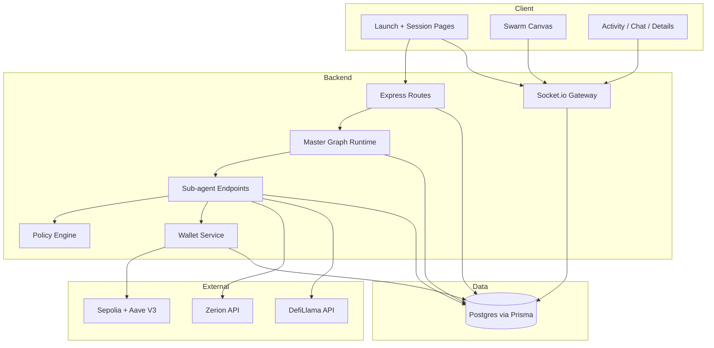
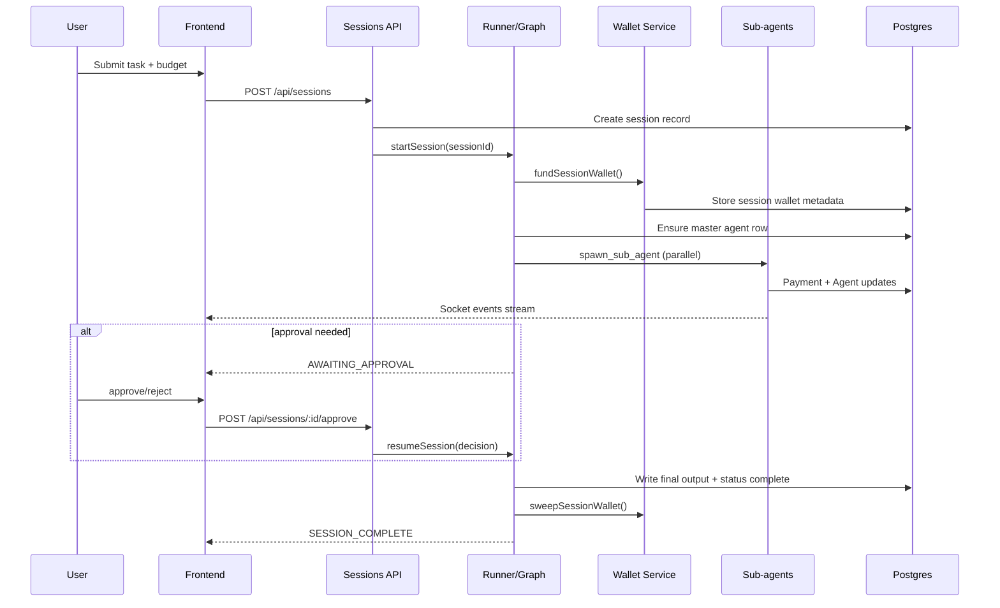

# Architecture and Design Deep Dive

This document expands the system architecture behind OhMySwarm with concrete runtime flows, data boundaries, and trade-offs.

## 1. System Context

OhMySwarm is a real-time, budget-aware multi-agent orchestration system for DeFi workflows.

Key constraints the architecture is built around:

- agents must be parallelizable without losing control of cost
- execution must be inspectable live by a human operator
- approvals must pause and resume deterministically
- wallet blast radius must be session-scoped

## 2. High-Level Components

## 3. Session Lifecycle

## 4. Orchestration Mechanics

The master graph is a ReAct loop with tool-only boundaries:

- `spawn_sub_agent`
- `request_approval`

### Why this matters

This keeps the coordination layer simple and testable:

- no direct protocol writes from master policy
- all execution side effects occur in typed tool handlers
- approval interrupts are first-class runtime events

### Parallel fan-out model

When multiple `spawn_sub_agent` tool calls are emitted in one LLM step, they are executed concurrently via `Promise.all`, then merged back as tool responses into the next reasoning cycle.

## 5. Budget and Payment Control

Spend control is split into two gates:

1. Reservation gate

- reserve session budget before sub-agent starts
- reject spawn early if budget is insufficient

2. Settlement gate

- perform x402 payment semantics prior to sub-agent endpoint execution
- persist payment status + tx hash

This avoids "work done but unpaid" and "paid but unconstrained" ambiguity.

## 6. Wallet Model

Treasury/session separation is deliberate:

- treasury wallet: canonical funding source
- session wallet: isolated signer for one task thread

Paid mode behavior:

- generate session keypair
- encrypt private key before DB write
- transfer USDC from treasury to session wallet
- top up session wallet ETH for gas
- execute Aave deposit flow in executor path

Free mode behavior:

- deterministic mock balances for fast development

## 7. Data Model Intent

Primary entities:

- `Session`: execution envelope + budget + status
- `Agent`: tree node in spawned swarm
- `ToolCall`: granular trace of tool execution
- `Payment`: spend ledger with tx reference
- `WalletMaster`: user wallet to master mapping

Design consequences:

- reproducible post-run traces
- straightforward per-session accounting
- easy UI hydration from persistent state

## 8. Real-Time Event Design

Socket.io rooms are session-scoped (`session:{id}`), enabling:

- low-noise event fanout
- targeted updates for only the active viewers
- deterministic UI updates without polling

Representative event stream:

- `SESSION_FUNDED`
- `AGENT_SPAWNED`
- `TOOL_CALLED` / `TOOL_RESULT`
- `PAYMENT_CONFIRMED`
- `AWAITING_APPROVAL`
- `SESSION_COMPLETE` / `SESSION_FAILED`

## 9. Frontend Design Language

The interface is designed as an operations console instead of a chat toy.

### Left panel: topology

- React Flow graph visualizes parent-child spawning
- running/completed/failed states are visible in-node
- payment and budget context remains visible during execution

### Right panel: command telemetry

- Activity tab for chronological lifecycle + payment evidence
- Chat tab for narrative and follow-up continuity
- Details tab for focused inspection of selected agent

### Interaction model

- floating follow-up input under canvas to maintain flow
- quick launch handoff to session room after first activity
- explicit approval modal when run is blocked on user intent

## 10. Reliability Choices

- durable checkpoints via LangGraph Postgres saver
- timeout boundaries for partner and agent calls
- fallback partner datasets for demo resilience
- CORS origin pattern matching for multi-environment deploys
- network-aware tx explorer links in UI

## 11. Trade-Offs and Future Extensions

Current trade-offs:

- single production execution venue (Aave on Sepolia)
- lightweight policy checks vs formal verification
- in-process eventing instead of dedicated message bus

Natural scale path:

- pluggable execution adapters per protocol/chain
- queue-backed agent jobs for horizontal workers
- richer policy DSL and onchain attestations
- strategy memory and comparative run analytics

## 12. Judge Checklist

For evaluators, the architecture should demonstrate:

- clear separation of orchestration, execution, walleting, and UI
- observable real-time state transitions
- explicit budget and approval controls
- practical partner API integration with graceful degradation
- realistic path from hackathon MVP to production system
